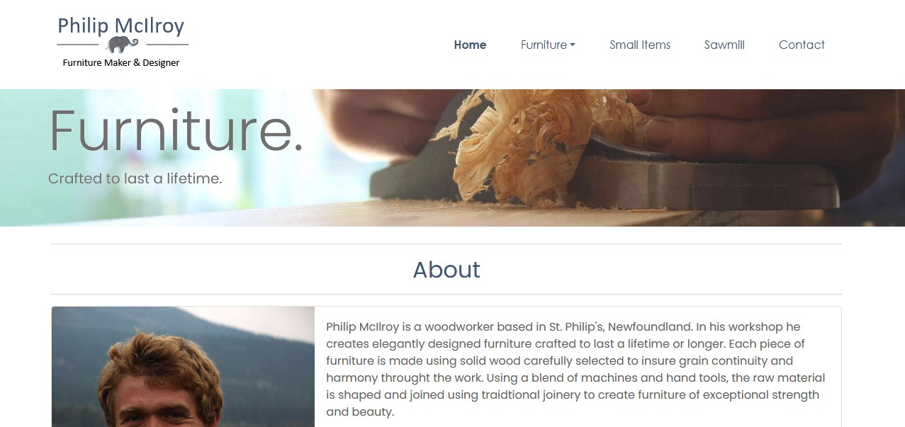

# Description
This is the first project I completed with Get Coding. It is a design for a website my husband will use for his furniture business once he gets that up and running. Once he has finished designing and prototyping his furniture, I will update the website and it will then be a space for him to market his furniture.

# Motivation
My husband is in the planning stages of starting his own furniture making business and will need a website to showcase his work. I thought this made a useful and interesting project to learn more HTML and CSS. Also I learnt this project to learn about using a framework (bootstrap).

# Built with
-HTML/
-CSS/
-Bootstrap/
-Javascript

# Demo site
https://isabelmcilroy.github.io/PhilipMcIlroyFineCarpentry/

